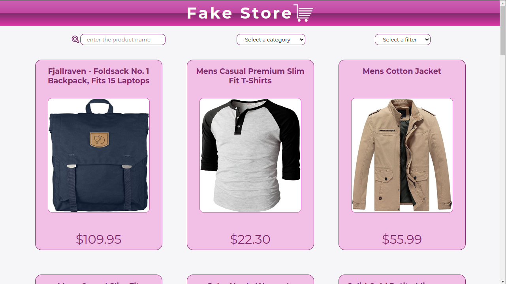

# Boas-vindas ao repositório do projeto de teste Fake Store!

O intuito deste projeto é criar uma aplicação **front-end** que simule uma loja virtual, com a exibição de produtos fictícios.




<details>
  <summary><strong>🏆 Sobre o Fake Store 🏆</strong></summary>

  Consiste em uma página de produtos, onde possibilita o usuário de executar as seguintes ações:

  **- Filtrar os produtos por nome/descrição**

  **- Filtrar os produtos por departamento**

  **- Ordenar os produtos pelo nome/preço**

  **- Acessar os detalhes dos produtos**

  **- Receber sugestões de produtos do mesmo departamento**

</details>
<details>
  <summary><strong>🚀 Primeiro passo 🚀</strong></summary>

Versão do node recomendada: **v20.6.1**!

Gerenciamento de pacotes recomendado: **Yarn** ou **Bun**!

Clone o repositório:

```bash
git clone git@git(url)
```

Instale as dependências:


```bash
yarn install
```

**OU**

```bash
bun install
```

</details>
<details>
  <summary><strong>⌨️ Rodando localmente</strong></summary>

Rode o projeto localmente:

```bash
(bun/yarn/npm) run dev
```

Ele estará rodando na porta **3000**

<br />

</details>
<details>
  <summary><strong>🧱 Estrutura do Projeto</strong></summary><br />
  Este repositório contém um template com a estrutura de diretórios e arquivos baseados na estrutura Repository Pattern, um padrão de design que abstrai a lógica de acesso aos dados, isolando-a em uma camada separada (repositories) Veja abaixo:

```
├──src
│   ├──@types
│   ├──components
│   ├──context
│   ├──images
│   ├──pages
│   ├──repositories
│   ├──services
|   ├──styles
|   ├──utils

```

**Descrição de cada pasta**

- `@types`: tipagem de qualquer contexto, componente ou página.

- `components`: componentes genéricos.

- `context`: configuração do contexto global.

- `pages`: configuração das rotas do next.

- `repositores`: funções de requisições para API.

- `services`: funções que auxiliam o tratamento das requisições.

- `styles`: arquivos que contém somente a estilização.

- `utils`: funções que auxiliam qualquer parte da aplicação.

</details>
<details>
  <summary><strong>🐳 Rodando no Docker 🐳</strong></summary>

Caso queira executar o projeto via `Docker compose`, substituindo o local, execute o comando:

```bash
docker compose up -d development 
```

**links para a instalação do docker e docker compose**

Docker:

```bash
https://www.digitalocean.com/community/tutorials/how-to-install-and-use-docker-on-ubuntu-20-04-pt
```

Docker Compose:

```bash
https://www.digitalocean.com/community/tutorials/how-to-install-and-use-docker-compose-on-ubuntu-22-04
```

</details>
<details>
  <summary><strong>🎛 Padrão de código / Lint 🎛</strong></summary>

1.`nome de variáveis e funções`: _(**inglês** sempre mantendo a **assertividade**)_.

2.`identação`: _(**2 casas**)_.

3.`tipagem`: _(Procurando não deixar vários **any** no código)_.

4.`quebra de linhas`: _(Procurando não deixar linhas **extensas** no código)_.

5.`tamanho de variaveis e funções`: _(Procurando dividir papéis separados em cada função, não deixando funções e variáveis **extensas** no código)_

  <br />
</details>
<details>
  <summary><strong>🍴 Ferramentas 🍴</strong></summary>

- `HTML`
- `CSS3`
- `Typescript`
- `Next.js`
- `React.js`

  <br />
</details>
<details>
  <summary><strong>🤝 Agradecimento 🤝</strong></summary><br />

  **Gostaria de agradecer pela oportunidade e mesmo que eu não prossiga no processo, foi mais um projeto que contribuiu para o meu conhecimento e minha autoestima!**

</details>
